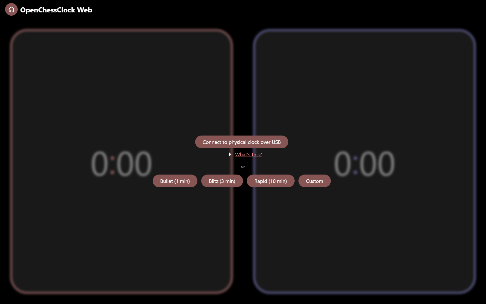
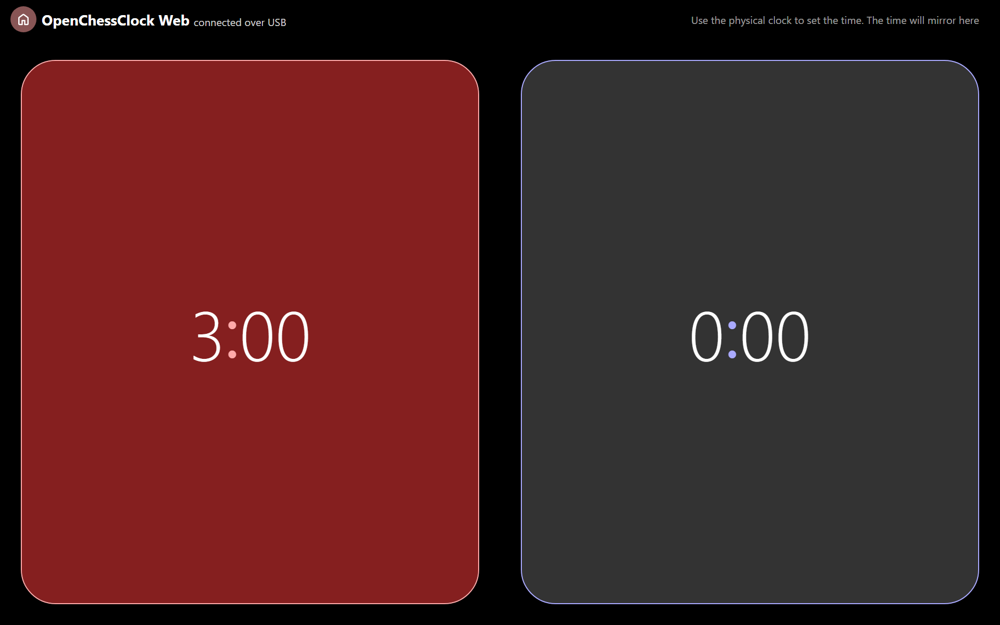

# OpenChessClock Web

A browser display for `open-chess-clock`. A vanilla JS web app built with Vite.

A little bit hacky, but it works! The website can connect to a chess clock
flashed with [this firmware](../README.md)!

## Screenshots

## Translations

I'd love to translate this, but this was a quick-and-dirty (though not as dirty
as some other projects) web app and isn't set up for that. PRs welcome!

## Dev server

Run `pnpm dev` to start up the dev server on `localhost:5173`. The port may
differ if port 5173 isn't available. You should see a message from Vite telling
you the port number.

## Build instructions

Run `pnpm build` to type-check and run the build script.
